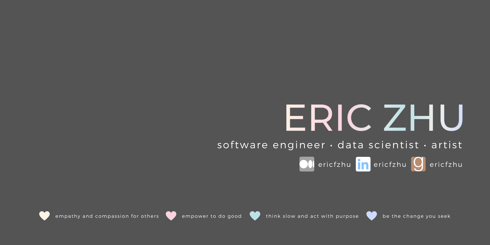

<!-- # Hey there!  -->



<!-- Welcome to my Github profile! You can also find me at these sites below :) -->

[//]: <> (Some of the badges here are just for my own motivation purposes.)

<!-- [](https://linkedin.com/in/ericfzhu/)
[](https://medium.com/@ericfzhu)
[](https://goodreads.com/ericfzhu)
[](https://kaggle.com/ericfzhu)
[](https://leetcode.com/ericfzhu/)
[](https://datacamp.com/profile/ericfzhu) -->

<!-- 
### My values

:blue_heart: Empathy and compassion for others

:purple_heart: Empower to do good

:green_heart: Think slow and act with purpose

:heart: Be the change you seek -->

### I sometimes code using:
<!-- 
#### Languages: -->


<!-- 
#### Databases:


 -->

<!-- #### Data Science / Machine Learning:


 -->

### I'm interested in exploring:


<!--  -->

<!--START_SECTION:waka-->
📊 **This Week I Spent My Time On** 

```text
💬 Programming Languages: 
Python                   28 hrs 51 mins      ██████████████████░░░░░░░   72.52% 
Jupyter                  5 hrs 20 mins       ███░░░░░░░░░░░░░░░░░░░░░░   13.42% 
JavaScript               2 hrs 23 mins       █░░░░░░░░░░░░░░░░░░░░░░░░   6.02% 
Markdown                 1 hr 13 mins        ░░░░░░░░░░░░░░░░░░░░░░░░░   3.09% 
GitIgnore file           34 mins             ░░░░░░░░░░░░░░░░░░░░░░░░░   1.45%

🐱‍💻 Projects: 
kuzushiji                17 hrs 15 mins      ██████████░░░░░░░░░░░░░░░   43.39% 
9444                     8 hrs 56 mins       █████░░░░░░░░░░░░░░░░░░░░   22.46% 
capstone                 7 hrs 9 mins        ████░░░░░░░░░░░░░░░░░░░░░   17.98% 
workspace                5 hrs 2 mins        ███░░░░░░░░░░░░░░░░░░░░░░   12.65% 
pytorch_image_classificat40 mins             ░░░░░░░░░░░░░░░░░░░░░░░░░   1.72%

```


 Last Updated on 22/11/2021
<!--END_SECTION:waka-->
